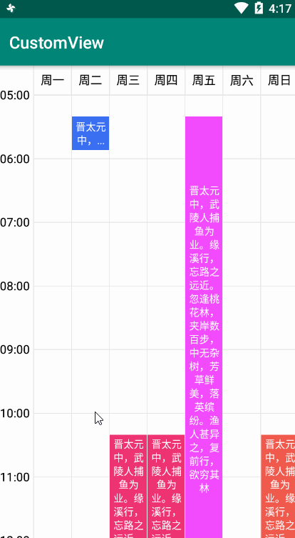
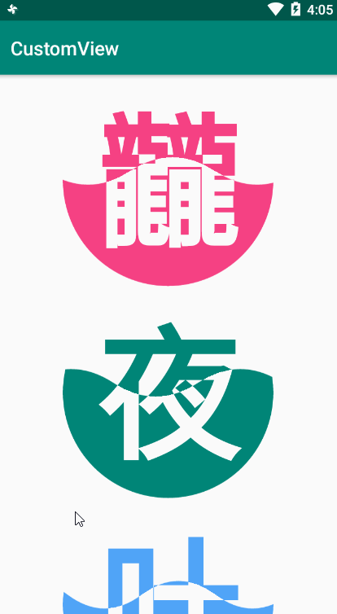

# CustomView

 - 自定义View合辑，持续更新中
   - 计划表
   - 跳跃小球（贝塞尔曲线-3）
   - 带文本的圆形波浪（贝塞尔曲线-2）
   - 波浪（贝塞尔曲线-1）
   - 仿QQ邮箱下拉刷新
   - 太极
   - 时钟
   - 饼状图
   - 下雨
 
## **Apk下载地址：[CustomView](https://www.pgyer.com/CustomView)**

     

     

         

      

      